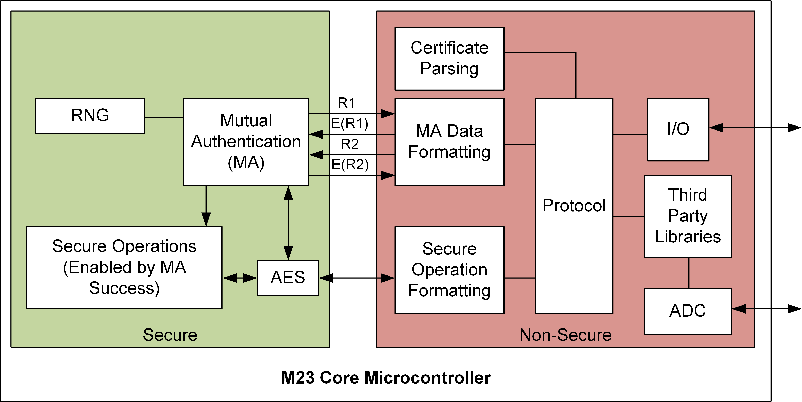

# On-Device Power Analysis Across Hardware Security Domains

This repository contains supporting code for the paper "On-Device Power Analysis Across Hardware Security Domains". Note the additional traces are not stored in this repo (due to the huge size).

The trace links are provided in the traces/README.md file.

You can find the paper PDF at https://eprint.iacr.org/2019/689.pdf .

## Abstract (Partially from paper)

New cores released (2018/2019) now bring the idea of hardware security domains to small low-cost devices. The first device released in this category was the Microchip SAML11, which features the M23 core.

A typical application is shown below. Note that the non-secure core can include risky/unvalidated code, with the assumption made that even if someone were to find a remotely exploitable security flaw (buffer overflow, parsing error, etc) the security domains render the attack impotent.

Note the M23 core does not include side-channel power attacks in the threat model it is protecting against. While side-channel power analysis is a powerful method of breaking secure cryptographic algorithms, typically power analysis is considered to require specialized measurement equipment on or near the device.

But assuming an attacker first gained the ability to run code on the unsecure side of a device, they could trigger encryptions and use the on-board ADC to capture power traces of that hardware encryption engine.

This is demonstrated on a SAML11 which contains a M23 core with a TrustZone-M implementation as the hardware security barrier. This attack requires **160 million traces**, or approximately **5 GByte of data**. This attack does not use any external measurement equipment, entirely performing the power analysis using the ADC on-board the microcontroller under attack. The attack is demonstrated to work both from the non-secure and secure environment on the chip, being a demonstration of a cross-domain power analysis attack.

To understand the effect of noise and sample rate reduction, an attack is mounted on the SAML11 hardware AES peripheral using classic external equipment, and results are compared for various sample rates and hardware setups.

This github repository includes information & code required to replicate results. Links to the trace storage is also made from this repo.

## Referencing this work

Please do not reference this GITHub repo. Instead reference the paper, link to E-Print version here: https://eprint.iacr.org/2019/689 (to appear in TCHES Volume 2019, Issue 1).

## Directory Listing

 * `notebooks` This directory contains jupyter notebooks for displaying results and capturing data. You can recreate most of the figures in the paper from this directory using Google Co-Lab to run the notebook on the cloud.
 * `firmware` This directory contains the firmware attacked.
 * `traces` This directory contains more details of the trace format & links to the traces.
 * `attack_scripts` The actual CPA attacks are done as Python scripts. This directory contains the scripts.

## Attack Script & Thanks

This work uses Lascar (https://github.com/Ledger-Donjon/lascar) extensively for performing the CPA attack. See PDF paper for acknowledgements.

