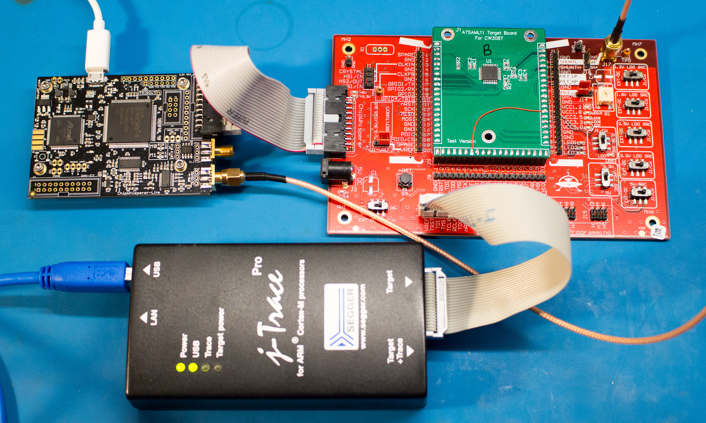
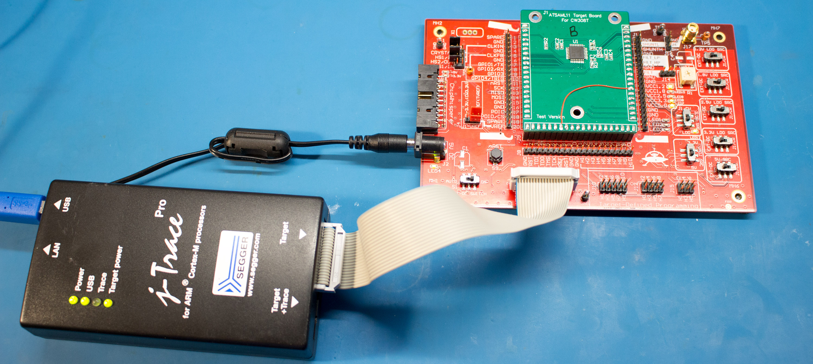
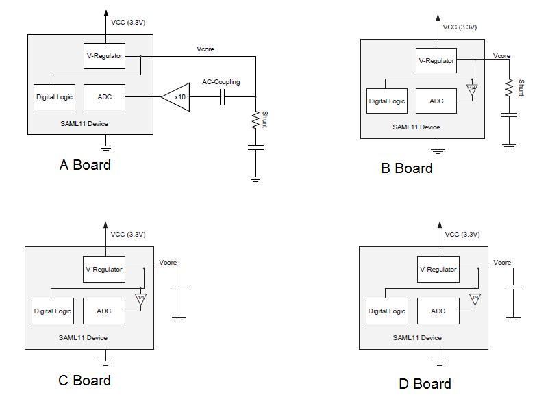
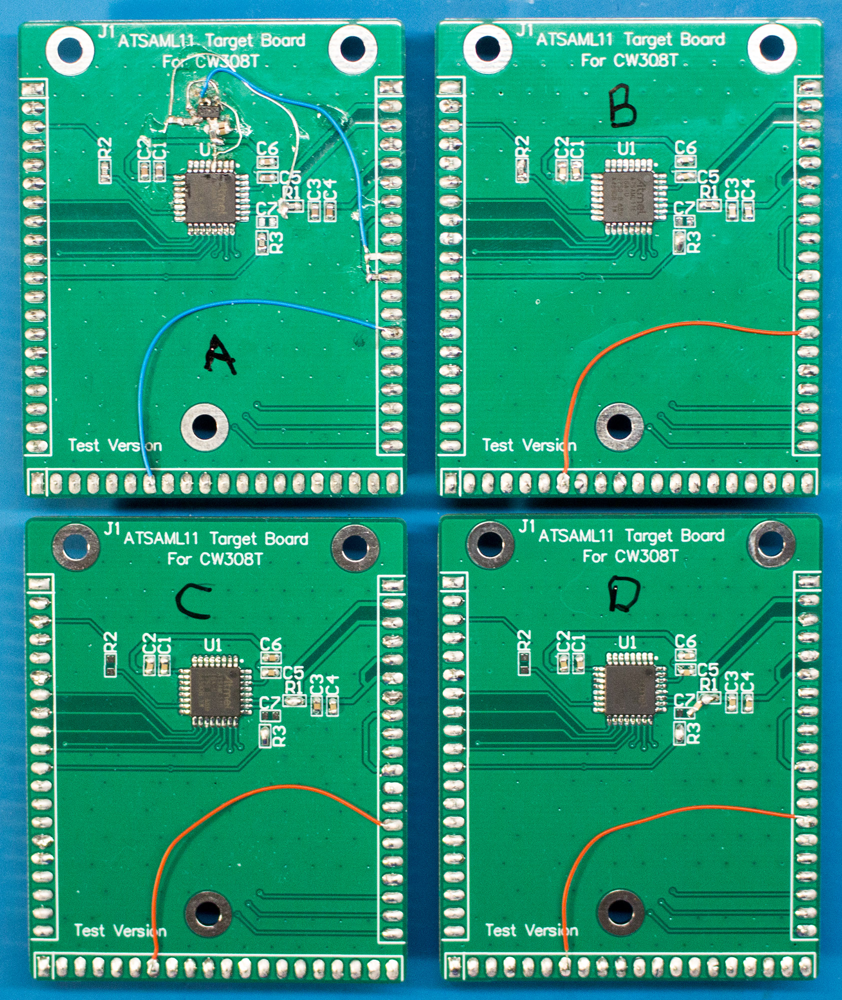
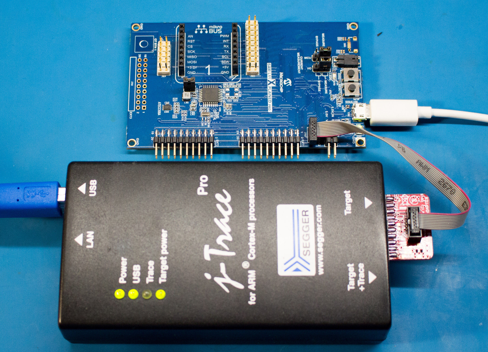

## CW308 Standard Attack

The first stage performs a regular (external) CPA attack. Here you can see a ChipWhisperer-Lite being used to perform an attack on a board with a shunt in the power line:

The design files for the SAML11 board can be found at [https://github.com/newaetech/chipwhisperer-target-cw308t/tree/master/CW308T_ATSAML11](https://github.com/newaetech/chipwhisperer-target-cw308t/tree/master/CW308T_ATSAML11)

Firmware for testing the device is part of the regular ChipWhisperer build system (including turning on hardware crypto). No special setup is required for this.

## CW308 Test Boards

The second stage of the attack is to use special boards without the external CW-Lite, because we are going to now use the internal ADC. In this case we use a Segger J-Link to perform RTT data transfer (a fast protocol over JTAG):

Each of the boards is labelled for various features, the idea is to go from "least difficult" to "most difficult". The idea is:

* A: External shunt + external op-amp for best signal.
* B: External shunt only.
* C: No shunt, decoupling caps mounted.
* D: No shunt, decoupling caps mounted + one extra decoupling cap than C.

The physical implementation is shown below:

Note that C & D made no practical difference, so results of C are not reported.

The little bodged on op-amp follows the schematic given in the file `opamp_schematic_boardA.pdf`. This was designed to provide some relatively OK level of gain, and centers the input around 0.6V.

## Dev-Kit Attack

The final stage of the attack demonstrates this is possible on an unmodified dev-kit. This is shown below:

## Note on Usage of JTAG/RTT Capture Mode

To make life easier, this work uses the Segger RTT module. You'll need a J-Link for this to work, but it doesn't need to be the super-fancy J-Trace. Our experience was the Ssegger tools are very nice so we use them extensively..